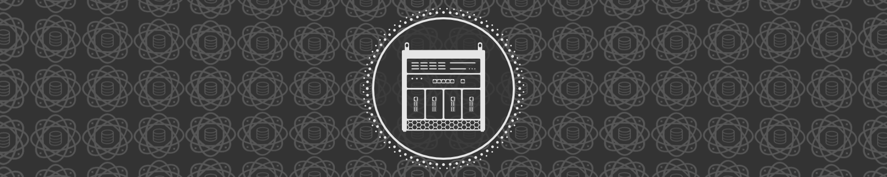

# My Raspberry Pi Homelab

> [!NOTE]
> I am just getting up and going with my homelab! I intend to continue adding content to this repo likely all the way through the end of 2026. I'll remove this note once I feel relatively solidified.

## Hardware
In this section, I'll share all the hardware for my personal homelab build. I have included links for purchase plus component prices, but please be aware that pricing / availability is likely subject to change. All my components were purchased during summer 2026. (Note: I am still updating this table. Will remove this note once my purchases are settled.)

| Product | Link | Price | Considerations |
|---------|------|-------|----------------|
| **Compute** | | | |
| Raspberry Pi 5 (x4) | [4GB model link](https://www.canakit.com/raspberry-pi-5-4gb.html) [8GB model link](https://www.canakit.com/raspberry-pi-5-8gb.html) | TBA (Haven’t decided on RAM sizes for all 4 yet) | Building with Raspberry Pi 5s. I will come back and update this later once I’ve settled on RAM sizes. |
| **Case** | | | |
| GeeekPi DeskPi RackMate T0 Plus 10-inch 4U Mini Server Cabinet (Black) | [Amazon link](https://a.co/d/04l6uONa) | $99.99 | Looking to keep as small as possible. Opted for the DeskPi RackMate T0 Plus over the standard T0 since it is a little deeper, giving me more wiggle room for components and cabling. |
| **Storage** | | | |
| OEM Samsung 256GB M.2 PCI-e NVME SSD GEN 4X4 Internal Solid State Drive 30mm 2230 Form Factor M Key Steam Deck | [Amazon link](https://a.co/d/02pP6kUk) | $247.80 ($61.95 each) | Opting for 256GB NVMe SSDs. Would have preferred 128GB, but they’re not readily available. Options I found for 128GB were only roughly $4 cheaper, at which point, why not just go for 256GB? |
| **Cooling / HAT** | | | |
| GeeekPi P31 M.2 NVME M-Key PoE+ HAT with Official Active Cooler for Raspberry Pi 5, Support M.2 NVMe SSD 2230 2242| [Amazon link](https://a.co/d/0hqzuAcu) | $143.96 ($35.99 each) | Opting for NVMe PoE+ HAT, specifically GeeekPi’s P31 version. They do offer a P33, but it looks like that is more recommended if you’re going to use 1TB+ storage. Also it appears that P31 is slightly smaller. P31 suffices for my use. |