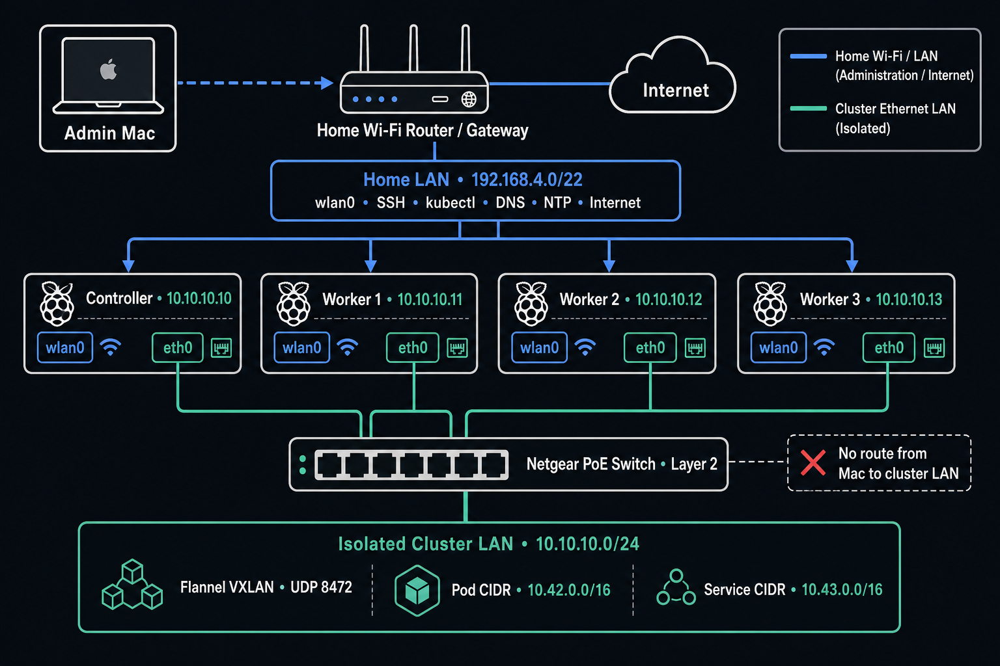

# Raspberry Pi k3s homelab: installation and operations runbook

This runbook builds a four-node, ARM64 [k3s](https://docs.k3s.io/) cluster on Raspberry Pi 5 computers. It is written for an experienced software engineer who is comfortable with containers and cloud services but may not manage Linux hosts or networks every day.

Follow the installation sections in order. Each command block says where to run it, what it proves or changes, and what success looks like. After installation, use the remaining sections as an operations reference.

The Pis are dedicated Kubernetes hosts: apart from Raspberry Pi OS and host-management software, deploy services through Kubernetes manifests.

The guide intentionally starts with a simple, understandable design:

- one k3s server using SQLite;
- three equal application workers;
- Flannel VXLAN networking over an isolated, static Ethernet network;
- Wi-Fi for home-LAN administration and Internet access;
- local-path storage on each node's NVMe SSD; and
- explicit but modest resource protections that will be adjusted from measurements.

The runbook pins `v1.36.2+k3s1`, which was the release returned by the official [stable channel](https://update.k3s.io/v1-release/channels/stable) when this guide was verified on **August 1, 2026**. Recheck the release notes, kubelet defaults, and this guide before changing Kubernetes minor versions.

> [!WARNING]
> This is a single-control-plane cluster. If `dkhundley-homelab-controller` fails, running containers on healthy workers will generally continue, but the Kubernetes API, new scheduling, and controller reconciliation will be unavailable until the controller is restored. Backups are essential; this topology is not control-plane high availability.

## Installation map

1. [Understand and record the inventory](#1-understand-and-record-the-inventory).
2. [Image and prepare all four Pis](#2-image-and-prepare-all-four-pis).
3. [Configure the dedicated Ethernet network](#3-configure-the-dedicated-ethernet-network).
4. [Install the controller](#4-install-the-controller).
5. [Join the workers one at a time](#5-join-the-workers-one-at-a-time).
6. [Configure administrator access from the Mac](#6-configure-administrator-access-from-the-mac).
7. [Validate the installation](#7-validate-the-installation).

Do not skip a failed check. Most commands deliberately fail with a nonzero exit status when an address, route, hostname, or configuration value is wrong.

## Architecture at a glance



The design gives every Pi two independent network paths:

- **`wlan0` (Wi-Fi)** connects to the home LAN. It carries SSH, Mac-to-Kubernetes API traffic, package updates, image pulls, NTP, DNS, and host or pod Internet access.
- **`eth0` (Ethernet)** connects only to the other Pis through the PoE switch. It carries k3s node traffic and cross-node pod traffic. It deliberately has no Internet gateway or DNS server.

The Mac talks to the controller through the controller's Wi-Fi-resolvable hostname. Workers talk to the controller through `10.10.10.10` on Ethernet. The Mac does not need—and this design does not provide—a route to the isolated `10.10.10.0/24` network.

### Networking terms used in this guide

- A **CIDR** such as `10.10.10.0/24` describes an IP-address range. Here, `/24` means addresses that share `10.10.10` are on the same subnet; the four Pis can therefore communicate directly without a router.
- A **gateway** is the router used to reach addresses outside the current network. The Wi-Fi router is the gateway to the home LAN and Internet. The isolated Ethernet network needs no gateway because all four peers are directly connected.
- The **default route** is the path a host uses when no more-specific route matches a destination. Every Pi must have exactly one default route, through `wlan0`.
- A **Layer-2 network** switches Ethernet frames between directly connected devices. The Netgear switch does this without acting as a router or DHCP server.
- A Kubernetes **node IP** identifies the host to the cluster. This runbook forces node IPs to use the `10.10.10.x` Ethernet addresses.
- The **pod network** supplies IPs to pods. The **service network** supplies stable virtual IPs to Kubernetes Services. Neither range is a physical LAN.
- **VXLAN** wraps, or encapsulates, pod traffic so pods on different Pis can communicate across the Ethernet network. Flannel provides this overlay and uses UDP `8472` between nodes.

### Hosts and roles

| Hostname | RAM | Role | Scheduling |
|---|---:|---|---|
| `dkhundley-homelab-controller` | 4 GB | Single k3s server with SQLite | Control-plane/system workloads only |
| `dkhundley-homelab-worker1` | 8 GB | Agent | Application workloads |
| `dkhundley-homelab-worker2` | 8 GB | Agent | Application workloads |
| `dkhundley-homelab-worker3` | 8 GB | Agent | Application workloads |

Putting the controller on the 4 GB Pi is deliberate. Four gigabytes is sufficient for this small k3s control plane, and using all three 8 GB Pis as workers creates a symmetric 24 GB physical application-worker pool. A `NoSchedule` control-plane taint is the primary protection against ordinary applications competing with the control plane. Kubernetes system workloads may still run wherever their tolerations and scheduling rules allow.

Each Pi uses:

- 64-bit Raspberry Pi OS Lite;
- its 256 GB NVMe SSD for `/`, k3s, and application storage;
- `eth0` with a static address on an isolated `10.10.10.0/24` cluster network;
- `wlan0` on the `192.168.4.0/22` home network for the default route, Internet access, SSH, and administration; and
- a unique hostname and SSH host identity.

The Netgear PoE switch is not uplinked to the home router and has no DHCP server. The fixed Ethernet addresses therefore come from this runbook, not the router.

| Hostname | k3s role | `eth0` cluster address | `wlan0` purpose |
|---|---|---|---|
| `dkhundley-homelab-controller` | Server/controller | `10.10.10.10/24` | Home LAN, Internet, SSH, and Mac API access |
| `dkhundley-homelab-worker1` | Agent | `10.10.10.11/24` | Home LAN, Internet, and SSH |
| `dkhundley-homelab-worker2` | Agent | `10.10.10.12/24` | Home LAN, Internet, and SSH |
| `dkhundley-homelab-worker3` | Agent | `10.10.10.13/24` | Home LAN, Internet, and SSH |

Traffic follows these paths:

- host-to-host k3s traffic uses the directly connected `10.10.10.0/24` route on `eth0`;
- cross-node pod traffic is encapsulated by Flannel VXLAN and sent between the nodes' `10.10.10.x` addresses over `eth0`;
- package updates, container-image pulls, NTP, and other host Internet traffic follow the default route over `wlan0`;
- pod Internet egress is masqueraded by the cluster networking and then follows the node's Wi-Fi default route; and
- the Mac uses the Bonjour/mDNS name `dkhundley-homelab-controller.local` for SSH and Kubernetes API administration. It does not need a reachable path to `10.10.10.0/24`.

Use a power supply and active cooling suitable for sustained Raspberry Pi 5 load. Power or thermal throttling can look like a Kubernetes capacity problem, so check `vcgencmd get_throttled` and temperatures when host performance is unexpectedly erratic.

The initial cluster uses the default k3s pod and service ranges, made explicit in configuration:

| Purpose | CIDR |
|---|---|
| Pods | `10.42.0.0/16` |
| Services | `10.43.0.0/16` |

Do not proceed if either range overlaps `10.10.10.0/24`, the `192.168.4.0/22` home LAN, a router route, or any VPN that clients or nodes use.

## Prerequisites and security boundaries

The admin Mac needs `ssh`, `scp`, `kubectl`, and `jq`. The guide uses macOS Bonjour/mDNS resolution so that `dkhundley-homelab-controller.local` resolves to the controller's Wi-Fi address without depending on router-provided DNS or a workstation hosts-file entry.

Keep cluster ports on the isolated Ethernet network and administrative ports on the trusted home network. Never expose Flannel UDP `8472` to the Internet.

| Network/interface | Protocol/port | Source | Destination | Purpose |
|---|---|---|---|---|
| Home LAN / `wlan0` | TCP `22` | Trusted admin devices | All nodes | SSH administration |
| Home LAN / `wlan0` | TCP `6443` | Mac or trusted admin subnet | Controller | External Kubernetes API access |
| Cluster LAN / `eth0` | TCP `6443` | Workers | Controller | Agent supervisor and Kubernetes API |
| Cluster LAN / `eth0` | UDP `8472` | Every node | Every node | Flannel VXLAN |
| Cluster LAN / `eth0` | TCP `10250` | Every node | Every node | Kubelet API and metrics |

SQLite does not require etcd ports `2379` and `2380`. Normal outbound DNS, NTP, package, image-registry, and HTTPS traffic must be permitted through `wlan0`, but those are not inbound k3s ports.

This runbook does not introduce a host firewall framework. If a firewall is already enabled, scope rules by source subnet and interface: allow node-to-node k3s ports from `10.10.10.0/24` on `eth0`, and allow SSH plus administrator API access only from the trusted home network on `wlan0`. Do not add a broad `8472/udp` rule on Wi-Fi. See the current [k3s networking requirements](https://docs.k3s.io/installation/requirements#networking).

The k3s server listens on all local addresses by default. This permits the Mac to reach TCP `6443` over Wi-Fi even though the server advertises its Ethernet address to the cluster. Do not bind the API only to `10.10.10.10`; that would break the direct Mac workflow.

NodePort, ingress, and load-balancer exposure are separate design decisions. Selecting Ethernet as the Kubernetes node address does not make an application safely or conveniently reachable from the home LAN. Expose each application deliberately when those components are added.

### How to read the command blocks

- **Run on** identifies the machine where the following block belongs. “All four Pis” means run the block separately on each host, not from the Mac.
- Values in angle brackets, all-caps placeholders such as `NAMESPACE`, and text beginning with `REPLACE_WITH_` must be replaced before use. Fixed hostnames, addresses, and CIDRs are literal values for this cluster.
- A successful `test` or `grep` check may print nothing. Its exit status is what matters; stop when a chained validation command fails.
- Exported variables exist only in the current shell. If you disconnect, reboot, or open a new terminal between related blocks, rerun the relevant `export` block.
- Commands using `tee ... <<EOF` write the following indented configuration into the named file. The closing `EOF` must remain on a line by itself.

## 1. Understand and record the inventory

The Ethernet addresses are fixed by this runbook rather than assigned by the home router. Record each interface's MAC address and the Wi-Fi name or address used for SSH. If the home router uses DHCP reservations for Wi-Fi, record those separately; they do not become k3s node addresses.

| Hostname | Ethernet MAC | Static `eth0` address | Wi-Fi SSH name/address | Notes |
|---|---|---|---|---|
| `dkhundley-homelab-controller` | `_________________` | `10.10.10.10/24` | `dkhundley-homelab-controller.local` | 4 GB; Mac-facing API endpoint |
| `dkhundley-homelab-worker1` | `_________________` | `10.10.10.11/24` | `_________________` | 8 GB |
| `dkhundley-homelab-worker2` | `_________________` | `10.10.10.12/24` | `_________________` | 8 GB |
| `dkhundley-homelab-worker3` | `_________________` | `10.10.10.13/24` | `_________________` | 8 GB |

After imaging and configuring each Pi in the next section, return to this table and collect the blank fields. Record the Wi-Fi name when it resolves reliably from the Mac; otherwise record the Wi-Fi address and update it if DHCP later changes it.

## 2. Image and prepare all four Pis

Use Raspberry Pi Imager to install current 64-bit Raspberry Pi OS Lite directly to each NVMe SSD. Configure an administrative user, SSH public-key access, locale, Wi-Fi, and the unique hostname. Avoid reusing an imaged system after its SSH host keys or machine identity have been generated.

### 2.1 Record each host's identity

**Run on:** each Pi, after its hostname and Wi-Fi are configured.

**Purpose:** confirm the assigned hostname and collect its Ethernet MAC and Wi-Fi identity for the inventory table.

```shell
hostnamectl --static
cat /sys/class/net/eth0/address
hostname -f
hostname -I
```

`cat` prints the Ethernet MAC. `hostname -f` prints the preferred Wi-Fi SSH name when local DNS is configured, and `hostname -I` shows current addresses as a fallback. Run `ip -4 addr show dev wlan0` if `hostname -I` returns more than one address and you need the Wi-Fi IPv4 address specifically.

**Run on:** the admin Mac, once for each Pi.

**Purpose:** verify that the recorded Wi-Fi identity reaches the intended machine before making system changes.

```shell
export ADMIN_USER="<your-admin-user>"
export SSH_TARGET="<Wi-Fi-SSH-name-or-address>"
ssh "$ADMIN_USER@$SSH_TARGET" hostnamectl --static
```

**Expected result:** the command prints the hostname assigned to that physical Pi. Stop and correct DNS, the recorded address, or the hostname if it prints a different node.

### 2.2 Update the operating system and verify the NVMe root

**Run on:** all four Pis.

Update Raspberry Pi OS, its packages, and the available EEPROM firmware, then reboot:

```shell
sudo apt update
sudo apt full-upgrade -y
sudo apt install -y ca-certificates curl jq openssl
sudo rpi-eeprom-update -a
sudo reboot
```

**Run on:** all four Pis, after reconnecting.

```shell
uname -m
findmnt -no SOURCE,FSTYPE,TARGET /
lsblk -o NAME,SIZE,FSTYPE,MOUNTPOINTS,MODEL
```

**Expected result:** `uname -m` reports `aarch64`, and the root source is an NVMe partition rather than the SD card. Inspect the output instead of assuming a device name. Stop if either condition is false.

Enable periodic discard and confirm its timer is scheduled. This is preferable to adding continuous `discard` mount options:

```shell
sudo systemctl enable --now fstrim.timer
systemctl status fstrim.timer --no-pager
```

### 2.3 Correct a hostname if Raspberry Pi Imager did not set it

Skip this subsection when the hostname already matches the inventory. Use cloud-init configuration so that both the hostname and cloud-init-managed `/etc/hosts` remain correct after reboot. Do not edit `/etc/hosts` directly when it says it is managed by cloud-init.

**Run on:** only a Pi whose hostname needs correction.

```shell
export NODE_NAME="REPLACE_WITH_THIS_NODE_HOSTNAME"
test "$NODE_NAME" != "REPLACE_WITH_THIS_NODE_HOSTNAME"

# In the editor, replace the placeholder with the value of NODE_NAME above.
sudoedit /etc/cloud/cloud.cfg.d/99-homelab-hostname.cfg

# Add these two lines to that file:
# hostname: REPLACE_WITH_THIS_NODE_HOSTNAME
# manage_etc_hosts: true

sudo hostnamectl set-hostname "$NODE_NAME"
sudo reboot
```

The valid names are `dkhundley-homelab-controller`, `dkhundley-homelab-worker1`, `dkhundley-homelab-worker2`, and `dkhundley-homelab-worker3`. After reboot, both commands below should report the selected name:

```shell
hostnamectl --static
getent hosts "$(hostnamectl --static)"
```

### 2.4 Enable memory cgroups and disable swap

Current [k3s Raspberry Pi requirements](https://docs.k3s.io/installation/requirements#operating-systems) require memory cgroups. Raspberry Pi OS normally enables them now, but add each missing parameter to the kernel's single command line if necessary.

**Run on:** all four Pis.

```shell
grep -qw 'cgroup_memory=1' /boot/firmware/cmdline.txt \
  || sudo sed -i '1 s/$/ cgroup_memory=1/' /boot/firmware/cmdline.txt
grep -qw 'cgroup_enable=memory' /boot/firmware/cmdline.txt \
  || sudo sed -i '1 s/$/ cgroup_enable=memory/' /boot/firmware/cmdline.txt
sudo reboot
```

Do not insert a newline into `/boot/firmware/cmdline.txt`.

**Run on:** all four Pis, after reboot.

```shell
stat -fc %T /sys/fs/cgroup
grep -w memory /sys/fs/cgroup/cgroup.controllers
```

**Expected result:** the first command reports `cgroup2fs`, and the second includes `memory`. Stop if either check fails.

Disable swap so memory pressure and pod evictions are predictable:

```shell
sudo swapoff -a
sudo systemctl disable --now dphys-swapfile.service 2>/dev/null || true
sudo systemctl mask dphys-swapfile.service 2>/dev/null || true
swapon --show
```

**Expected result:** `swapon --show` prints nothing. Inspect `/etc/fstab` and remove or comment any persistent swap-file or swap-partition entry, then reboot and check again. Although k3s can start with swap, this cluster deliberately does not rely on it.

## 3. Configure the dedicated Ethernet network

The switch does not assign addresses, so this section gives each `eth0` interface its fixed inventory address. It also prevents Ethernet from taking over Internet-bound traffic.

### 3.1 Assign the fixed Ethernet address

**Run on:** all four Pis, one at a time.

First derive the required address from the node's hostname and identify the NetworkManager connection profile attached to `eth0`:

```shell
export NODE_NAME="$(hostnamectl --static)"

case "$NODE_NAME" in
  dkhundley-homelab-controller) export NODE_ETHERNET_IP="10.10.10.10/24" ;;
  dkhundley-homelab-worker1)   export NODE_ETHERNET_IP="10.10.10.11/24" ;;
  dkhundley-homelab-worker2)   export NODE_ETHERNET_IP="10.10.10.12/24" ;;
  dkhundley-homelab-worker3)   export NODE_ETHERNET_IP="10.10.10.13/24" ;;
  *) echo "Unexpected hostname: $NODE_NAME" >&2; export NODE_ETHERNET_IP="" ;;
esac

test -n "$NODE_ETHERNET_IP"
export ETH_CONNECTION="$(nmcli -g GENERAL.CONNECTION device show eth0)"
test -n "$ETH_CONNECTION"
test "$ETH_CONNECTION" != "--"
printf 'Configuring %s on profile %s\n' "$NODE_ETHERNET_IP" "$ETH_CONNECTION"
```

**Expected result:** the final line names the correct `10.10.10.x/24` address and a connection profile. Stop if any `test` command fails. The profile is commonly named `netplan-eth0`, but discovering it avoids depending on that generated name.

Configure the connection with no gateway or DNS server and explicitly prevent it from supplying the default route:

```shell
sudo nmcli connection modify "$ETH_CONNECTION" \
  ipv4.method manual \
  ipv4.addresses "$NODE_ETHERNET_IP" \
  ipv4.gateway "" \
  ipv4.dns "" \
  ipv4.never-default yes

sudo nmcli connection up "$ETH_CONNECTION"
```

Do not add a gateway to make the isolated network look more conventional. Every `10.10.10.x` peer is on the directly connected subnet, so no router is required.

### 3.2 Verify the link, addresses, and routes

**Run on:** all four Pis.

Verify the persistent connection settings and current interface state:

```shell
nmcli -f ipv4.method,ipv4.addresses,ipv4.gateway,ipv4.dns,ipv4.never-default \
  connection show "$ETH_CONNECTION"
ip -br link show
ip -4 -br address show
ip -4 route
cat /sys/class/net/eth0/speed
cat /sys/class/net/eth0/duplex
cat /sys/class/net/eth0/carrier
```

The last three commands should report `1000`, `full`, and `1`, respectively: gigabit speed, full duplex, and an active carrier. Each node should have a routing table equivalent to:

```text
default via 192.168.4.1 dev wlan0
10.10.10.0/24 dev eth0 proto kernel scope link src 10.10.10.x
192.168.4.0/22 dev wlan0 proto kernel scope link src 192.168.x.x
```

Route ordering and extra NetworkManager fields can differ. The required invariants are:

- exactly one default route through `wlan0`;
- no default route through `eth0`; and
- a directly connected `10.10.10.0/24` route through `eth0`.

Stop and correct the NetworkManager profile if any invariant is false.

### 3.3 Prove the Ethernet and Wi-Fi paths

**Run on:** all four Pis after every Pi has its fixed Ethernet address.

Select an Ethernet peer and prove both route paths before installing k3s:

```shell
case "$NODE_NAME" in
  dkhundley-homelab-controller) export ETHERNET_PEER="10.10.10.11" ;;
  *)              export ETHERNET_PEER="10.10.10.10" ;;
esac

ip -4 route get "$ETHERNET_PEER" | grep -w 'dev eth0'
ip -4 route get 192.168.4.1 | grep -w 'dev wlan0'
ip -4 route get 1.1.1.1 | grep -w 'dev wlan0'
test -z "$(ip -4 route show default dev eth0)"
ping -I eth0 -c 3 "$ETHERNET_PEER"
```

Repeat the Ethernet ping for all other peer addresses when validating the switch and cabling. Sub-millisecond latency is expected on this local link. Also confirm Internet and DNS access through Wi-Fi:

```shell
ping -I wlan0 -c 3 192.168.4.1
getent hosts update.k3s.io
curl -fsSIL https://update.k3s.io/ >/dev/null
```

### 3.4 Complete the pre-installation readiness check

These checks do not configure anything. Together, they catch identity, routing, and clock problems that would otherwise make a node join incorrectly.

**Run on:** all four Pis.

```shell
hostnamectl --static
ip -br link
ip -br address
ip route
timedatectl status
timedatectl show -p NTPSynchronized --value
```

Read the output as follows. Exact Wi-Fi addresses, gateways, and interface-state wording will vary by home network and whether a cable is connected.

| Check | What it establishes | Expected result |
|---|---|---|
| `hostnamectl --static` | This Pi has the intended node identity. | One of the four inventory names, and specifically the name assigned to this Pi. |
| `ip -br link` | The expected network devices exist and are usable. | `eth0` and `wlan0` are present. `wlan0` must be `UP`; `eth0` should be `UP` when its Ethernet cable is connected. |
| `ip -br address` | Each network has the right address. | `eth0` has this node's assigned address from `10.10.10.10/24` through `10.10.10.13/24`. `wlan0` has a home-LAN address (normally `192.168.4.x/22` here). Other addresses, such as IPv6, are not a concern. |
| `ip route` | Cluster traffic and general traffic will take different paths. | A directly connected `10.10.10.0/24 dev eth0` route is present. There is exactly one `default` route, and it uses `wlan0`—never `eth0`. |
| `timedatectl status` | The system time service is enabled and the displayed clock, time zone, and synchronization state look sensible. | `System clock synchronized: yes` once it has had time to contact NTP. |
| `timedatectl show -p NTPSynchronized --value` | A script-friendly, unambiguous NTP check. | `yes`. It can briefly be `no` just after boot or after Wi-Fi reconnects; wait a minute and check again. |

Verify the Mac-facing mDNS identity separately:

**Run on:** the admin Mac.

```shell
dscacheutil -q host -a name dkhundley-homelab-controller.local
```

The lookup must return a home-LAN address for the controller, not its isolated `10.10.10.10` Ethernet address. Do not install k3s until this lookup works, every Ethernet address matches the static inventory, the only default route uses `wlan0`, and `NTPSynchronized` is `yes`. If a check fails, correct the relevant mDNS, Wi-Fi, gateway, Ethernet profile, or NTP issue first.

Finally, inspect every route, including VPN routes:

**Run on:** all four Pis.

```shell
ip route show table all
ip route show table all | grep -E '10\.42\.|10\.43\.' || true
```

Before k3s is installed, the second command should print nothing. Also inspect router and VPN configuration that is not visible in the node's current route table.

**Ready to continue when:** every Pi has the correct hostname and `10.10.10.x/24` address, exactly one default route through Wi-Fi, working DNS and Internet access, synchronized time, memory cgroups, no swap, and no pod/service CIDR overlap.

## 4. Install the controller

This step installs the only k3s server and Kubernetes control plane. The controller uses SQLite and is tainted so ordinary application pods are scheduled onto workers.

### 4.1 Verify the controller identity and route

**Run on:** `dkhundley-homelab-controller`.

The address is fixed by the cluster inventory:

```shell
export CONTROLLER_NAME="dkhundley-homelab-controller"
export CONTROLLER_ADMIN_ENDPOINT="${CONTROLLER_NAME}.local"
export CONTROLLER_IP="10.10.10.10"
test "$(hostnamectl --static)" = "$CONTROLLER_NAME"
ip -4 address show dev eth0 | grep -F "${CONTROLLER_IP}/24"
ip -4 route get 10.10.10.11 | grep -w 'dev eth0'
test -z "$(ip -4 route show default dev eth0)"
```

**Expected result:** every command exits successfully. Stop if the hostname, Ethernet address, worker route, or default-route check fails.

### 4.2 Create the server configuration and agent token

**Run on:** `dkhundley-homelab-controller`.

Create a separate agent-only token and the root-owned server configuration:

```shell
sudo install -d -o root -g root -m 0755 /etc/rancher/k3s
openssl rand -hex 32 | sudo tee /etc/rancher/k3s/agent-token >/dev/null
sudo chown root:root /etc/rancher/k3s/agent-token
sudo chmod 0600 /etc/rancher/k3s/agent-token

sudo tee /etc/rancher/k3s/config.yaml >/dev/null <<EOF
node-name: "${CONTROLLER_NAME}"
node-ip: "${CONTROLLER_IP}"
advertise-address: "${CONTROLLER_IP}"
tls-san:
  - "${CONTROLLER_NAME}"
  - "${CONTROLLER_ADMIN_ENDPOINT}"
  - "${CONTROLLER_IP}"
cluster-cidr: "10.42.0.0/16"
service-cidr: "10.43.0.0/16"
cluster-domain: "cluster.local"
flannel-backend: "vxlan"
flannel-iface: "eth0"
secrets-encryption: true
agent-token-file: "/etc/rancher/k3s/agent-token"
write-kubeconfig-mode: "0600"
disable:
  - "traefik"
  - "servicelb"
node-taint:
  - "node-role.kubernetes.io/control-plane=true:NoSchedule"
EOF
sudo chown root:root /etc/rancher/k3s/config.yaml
sudo chmod 0600 /etc/rancher/k3s/config.yaml
```

SQLite is selected intentionally by omitting `cluster-init` and `datastore-endpoint`; it is the k3s default for a single server. CoreDNS, metrics-server, local-path storage, and the network-policy controller remain enabled. Traefik and ServiceLB are disabled so ingress and load balancing can later be installed and managed through this repository's Kubernetes manifests.

`node-ip`, `advertise-address`, and `flannel-iface` make the Ethernet network explicit instead of relying on automatic interface detection. Do not add `node-external-ip`: the Wi-Fi address is an administration and egress path, not a Kubernetes node address. Also do not set `bind-address` to `10.10.10.10`; retaining the default `0.0.0.0` listener is what allows the Mac to reach the API through the controller's Wi-Fi address. See the [k3s server configuration reference](https://docs.k3s.io/cli/server).

The bare `dkhundley-homelab-controller` name remains the Kubernetes node identity, `dkhundley-homelab-controller.local` is the Mac-facing Bonjour/mDNS identity, and `10.10.10.10` is the server's Ethernet identity. Every hostname used to access the API must appear exactly in `tls-san`; the external kubeconfig therefore uses the `.local` name. Until manifest-managed ingress and load balancing are added, expose applications deliberately with `ClusterIP`, `NodePort`, or `kubectl port-forward` as appropriate; do not expose the Kubernetes API or VXLAN to the public Internet.

### 4.3 Create the controller's kubelet resource policy

**Run on:** `dkhundley-homelab-controller`.

Create this drop-in before starting k3s. The values protect capacity for the host and control-plane processes and configure emergency eviction thresholds. [How Kubernetes resource protection works](#how-kubernetes-resource-protection-works) explains the rationale in detail.

```shell
sudo install -d -o root -g root -m 0755 \
  /var/lib/rancher/k3s/agent/etc/kubelet.conf.d
sudo tee /var/lib/rancher/k3s/agent/etc/kubelet.conf.d/10-homelab-resources.conf >/dev/null <<'EOF'
apiVersion: kubelet.config.k8s.io/v1beta1
kind: KubeletConfiguration
mergeDefaultEvictionSettings: true
systemReserved:
  cpu: "100m"
  memory: "256Mi"
kubeReserved:
  cpu: "400m"
  memory: "1Gi"
evictionHard:
  memory.available: "256Mi"
  nodefs.available: "10%"
  nodefs.inodesFree: "5%"
  imagefs.available: "10%"
  imagefs.inodesFree: "5%"
evictionMinimumReclaim:
  nodefs.available: "10%"
  imagefs.available: "10%"
EOF
sudo chown root:root \
  /var/lib/rancher/k3s/agent/etc/kubelet.conf.d/10-homelab-resources.conf
sudo chmod 0600 \
  /var/lib/rancher/k3s/agent/etc/kubelet.conf.d/10-homelab-resources.conf
```

### 4.4 Install the pinned k3s server

**Run on:** `dkhundley-homelab-controller`.

Install the pinned server release. The installer creates and starts the `k3s` systemd service; ongoing configuration comes from `config.yaml`, not installer arguments.

```shell
curl -sfL https://get.k3s.io \
  | INSTALL_K3S_VERSION="v1.36.2+k3s1" sh -s - server

sudo systemctl status k3s --no-pager
sudo k3s kubectl get nodes -o wide
sudo k3s secrets-encrypt status
```

**Expected result:** the `k3s` service is active, the controller appears in the node list, and secrets encryption is enabled. Some packaged add-ons may remain Pending while the tainted controller is the only node; that is expected until the first worker joins.

If startup fails, inspect the service log:

```shell
sudo journalctl -u k3s -b --no-pager -n 200
```

## 5. Join the workers one at a time

Never copy `/var/lib/rancher/k3s/server/token` to a worker. That server token grants server privileges and is also required to decrypt confidential bootstrap data during restore. Agents receive only `/var/lib/rancher/k3s/server/agent-token`.

Repeat the following subsections for `worker1`, `worker2`, and `worker3`, waiting for each node to become Ready before starting the next. Sequential joins make hostname, token, address, cgroup, and firewall failures much easier to isolate.

The SSH examples in this section use key-based authentication with the private key at `~/.ssh/homelab`, the `dkhundley` account, and each Raspberry Pi's `.local` mDNS hostname.

### 5.1 Transfer the agent-only token

**Run on:** the admin Mac, once per worker.

For each worker, first transfer the agent token directly over SSH from the controller. Run this on the admin workstation, changing `worker1` to the worker currently being joined:

```shell
export SSH_IDENTITY="$HOME/.ssh/homelab"
export CONTROLLER_SSH="dkhundley@dkhundley-homelab-controller.local"
export WORKER_SSH="dkhundley@dkhundley-homelab-worker1.local"

ssh -i "$SSH_IDENTITY" "$CONTROLLER_SSH" \
  'sudo cat /var/lib/rancher/k3s/server/agent-token' \
  | ssh -i "$SSH_IDENTITY" "$WORKER_SSH" \
    'sudo install -d -o root -g root -m 0755 /etc/rancher/k3s &&
     sudo tee /etc/rancher/k3s/agent-token >/dev/null &&
     sudo chown root:root /etc/rancher/k3s/agent-token &&
     sudo chmod 0600 /etc/rancher/k3s/agent-token'
```

This avoids saving the token on the workstation. It assumes the SSH account can use `sudo`; if interactive sudo policy prevents the pipeline, perform the same read and write in two trusted terminal sessions without placing the token in shell history or source control.

### 5.2 Validate the worker and controller path

**Run on:** the worker currently being joined.

Connect to that worker from the admin Mac, changing `worker1` as needed:

```shell
ssh -i "$HOME/.ssh/homelab" \
  dkhundley@dkhundley-homelab-worker1.local
```

Derive and validate its fixed Ethernet value from its hostname:

```shell
export CONTROLLER_IP="10.10.10.10"
export NODE_NAME="$(hostnamectl --static)"

case "$NODE_NAME" in
  dkhundley-homelab-worker1) export NODE_IP="10.10.10.11" ;;
  dkhundley-homelab-worker2) export NODE_IP="10.10.10.12" ;;
  dkhundley-homelab-worker3) export NODE_IP="10.10.10.13" ;;
  *) echo "Unexpected worker hostname: $NODE_NAME" >&2; export NODE_IP="" ;;
esac

test -n "$NODE_IP"
ip -4 address show dev eth0 | grep -F "${NODE_IP}/24"
ip -4 route get "$CONTROLLER_IP" | grep -w 'dev eth0'
test -z "$(ip -4 route show default dev eth0)"
curl -kfsS --connect-timeout 5 \
  "https://${CONTROLLER_IP}:6443/cacerts" >/dev/null
test -s /etc/rancher/k3s/agent-token
```

Stop if any check fails. The `/cacerts` request is an unauthenticated bootstrap connectivity check; use `-k` only for this reachability check and never to bypass certificate verification for authenticated API requests.

### 5.3 Create the agent configuration and resource policy

**Run on:** the worker currently being joined.

Create the agent configuration:

```shell
sudo tee /etc/rancher/k3s/config.yaml >/dev/null <<EOF
server: "https://${CONTROLLER_IP}:6443"
token-file: "/etc/rancher/k3s/agent-token"
node-name: "${NODE_NAME}"
node-ip: "${NODE_IP}"
flannel-iface: "eth0"
EOF
sudo chown root:root /etc/rancher/k3s/config.yaml
sudo chmod 0600 /etc/rancher/k3s/config.yaml
```

Do not add `node-role.kubernetes.io/worker` through the agent's `node-label` setting. The `kubernetes.io` namespace is reserved, and the [kubelet rejects restricted role labels passed through `--node-labels`](https://kubernetes.io/docs/reference/command-line-tools-reference/kubelet/#options); on `v1.36.2+k3s1`, that prevents the agent service from starting. Apply the optional worker-role label through the Kubernetes API from the controller only after the node has registered.

Create the worker kubelet drop-in before starting k3s. [How Kubernetes resource protection works](#how-kubernetes-resource-protection-works) explains these role-specific values.

```shell
sudo install -d -o root -g root -m 0755 \
  /var/lib/rancher/k3s/agent/etc/kubelet.conf.d
sudo tee /var/lib/rancher/k3s/agent/etc/kubelet.conf.d/10-homelab-resources.conf >/dev/null <<'EOF'
apiVersion: kubelet.config.k8s.io/v1beta1
kind: KubeletConfiguration
mergeDefaultEvictionSettings: true
systemReserved:
  cpu: "100m"
  memory: "256Mi"
kubeReserved:
  cpu: "150m"
  memory: "384Mi"
evictionHard:
  memory.available: "512Mi"
  nodefs.available: "10%"
  nodefs.inodesFree: "5%"
  imagefs.available: "10%"
  imagefs.inodesFree: "5%"
evictionMinimumReclaim:
  nodefs.available: "10%"
  imagefs.available: "10%"
EOF
sudo chown root:root \
  /var/lib/rancher/k3s/agent/etc/kubelet.conf.d/10-homelab-resources.conf
sudo chmod 0600 \
  /var/lib/rancher/k3s/agent/etc/kubelet.conf.d/10-homelab-resources.conf
```

### 5.4 Install the agent and wait for Ready

**Run on:** the worker currently being joined.

Install and start the pinned agent:

```shell
curl -sfL https://get.k3s.io \
  | INSTALL_K3S_VERSION="v1.36.2+k3s1" sh -s - agent

sudo systemctl status k3s-agent --no-pager
sudo journalctl -u k3s-agent -b --no-pager -n 100
```

The worker configuration deliberately uses the controller's Ethernet URL, not `https://dkhundley-homelab-controller:6443` and not the controller's Wi-Fi address. See the [k3s agent configuration reference](https://docs.k3s.io/cli/agent).

**Run on:** the controller.

From a separate terminal on the admin Mac, connect to the controller:

```shell
ssh -i "$HOME/.ssh/homelab" \
  dkhundley@dkhundley-homelab-controller.local
```

Wait for the worker to become Ready:

```shell
sudo k3s kubectl get nodes -o wide --watch
```

Use `Ctrl-C` after the new node reports `Ready`, then label its role through the administrator credential. Change `worker1` to the worker currently being joined:

```shell
export NODE_NAME="dkhundley-homelab-worker1"
sudo k3s kubectl label node "$NODE_NAME" \
  node-role.kubernetes.io/worker=worker
sudo k3s kubectl get node "$NODE_NAME" -o wide
```

**Expected result:** the new node reports `Ready`, shows the `worker` role, and has its assigned `10.10.10.x` InternalIP. Repeat the entire section for the next worker.

## 6. Configure administrator access from the Mac

`/etc/rancher/k3s/k3s.yaml` is an unrestricted `system:admin` credential. Store it with mode `0600`, never commit it, and do not give it to applications or other users.

**Run on:** the admin Mac.

```shell
export SSH_IDENTITY="$HOME/.ssh/homelab"
export CONTROLLER_SSH="dkhundley@dkhundley-homelab-controller.local"
export CONTROLLER_ADMIN_ENDPOINT="dkhundley-homelab-controller.local"
export KUBECONFIG="$HOME/.kube/k3s-homelab.yaml"

dscacheutil -q host -a name "$CONTROLLER_ADMIN_ENDPOINT"
nc -vz "$CONTROLLER_ADMIN_ENDPOINT" 6443
install -d -m 0700 "$HOME/.kube"
umask 077
(
  set -e
  TEMP_KUBECONFIG="$(mktemp "${KUBECONFIG}.XXXXXX")"
  trap 'rm -f "$TEMP_KUBECONFIG"' EXIT
  ssh -i "$SSH_IDENTITY" "$CONTROLLER_SSH" \
    'sudo cat /etc/rancher/k3s/k3s.yaml' \
    > "$TEMP_KUBECONFIG"
  test -s "$TEMP_KUBECONFIG"
  kubectl --kubeconfig "$TEMP_KUBECONFIG" config set-cluster default \
    --server="https://${CONTROLLER_ADMIN_ENDPOINT}:6443"
  test "$(kubectl --kubeconfig "$TEMP_KUBECONFIG" \
    config current-context)" = "default"
  mv "$TEMP_KUBECONFIG" "$KUBECONFIG"
  trap - EXIT
) && chmod 0600 "$KUBECONFIG" \
  && kubectl --kubeconfig "$KUBECONFIG" get nodes -o wide
```

On macOS, `dscacheutil` proves that Bonjour/mDNS resolves the selected name through the home network, and `nc` proves that the Wi-Fi API listener is reachable. The temporary file and chained success checks prevent a failed SSH command from replacing a valid kubeconfig with an empty or incomplete file. The kubeconfig must not use `10.10.10.10`, because the home network provides no path to the isolated Ethernet subnet. The endpoint must exactly match a name or address in `tls-san`; otherwise `kubectl` will report an x509 hostname error.

The `KUBECONFIG` export above applies only to the current shell. Persist it for new interactive zsh sessions without copying the administrator credential into another file:

```shell
grep -qxF 'export KUBECONFIG="$HOME/.kube/k3s-homelab.yaml"' \
  "$HOME/.zshrc" 2>/dev/null \
  || printf '%s\n' \
    'export KUBECONFIG="$HOME/.kube/k3s-homelab.yaml"' \
    >> "$HOME/.zshrc"
source "$HOME/.zshrc"
chmod 0600 "$KUBECONFIG"
test "$KUBECONFIG" = "$HOME/.kube/k3s-homelab.yaml"
kubectl config current-context
kubectl get nodes -o wide
```

Open a new terminal and repeat the final three read-only checks to confirm that zsh loaded the setting automatically. The shell startup file contains only the kubeconfig path; the credential remains in the protected `k3s-homelab.yaml` file.

The server automatically rotates client certificates embedded in its local kubeconfig when k3s starts and they are near expiration, but a copied file is not refreshed automatically. Periodically recopy it, especially after certificate rotation. See [Cluster Access](https://docs.k3s.io/cluster-access).

The remainder of this guide assumes either `KUBECONFIG` is exported as above or `--kubeconfig "$HOME/.kube/k3s-homelab.yaml"` is added to each `kubectl` command.

**Expected result:** the final command returns all four nodes. Stop if name resolution, TCP `6443`, certificate validation, or authentication fails; use [the API troubleshooting section](#the-mac-cannot-reach-the-api-or-reports-an-x509-error) before continuing.

## 7. Validate the installation

### 7.1 Nodes, version, taint, and add-ons

**Run on:** the admin Mac.

```shell
kubectl get nodes -o wide
kubectl get nodes \
  -l node-role.kubernetes.io/worker=worker \
  -o name
kubectl get pods -A -o wide
kubectl get storageclass
kubectl describe node dkhundley-homelab-controller | sed -n '/Taints:/p'
kubectl get pods -A | grep -E 'traefik|svclb' || true
```

Confirm:

- exactly four ARM64 nodes are `Ready` and report `v1.36.2+k3s1`;
- their Kubernetes InternalIPs are exactly `10.10.10.10`, `.11`, `.12`, and `.13` according to the inventory;
- exactly three nodes have the `node-role.kubernetes.io/worker=worker` label;
- the controller has `node-role.kubernetes.io/control-plane=true:NoSchedule`;
- CoreDNS, metrics-server, and local-path provisioner are healthy;
- no Traefik or `svclb` pod exists; and
- `local-path` is the expected default StorageClass.

### 7.2 Verify both network paths and advertised node addresses

First prove that the external kubeconfig uses the controller's Bonjour/mDNS name rather than its isolated Ethernet address:

**Run on:** the admin Mac.

```shell
test "$(kubectl config view --minify \
  -o jsonpath='{.clusters[0].cluster.server}')" \
  = "https://dkhundley-homelab-controller.local:6443"
nc -vz dkhundley-homelab-controller.local 6443
kubectl cluster-info
```

Then verify every Kubernetes InternalIP exactly. These checks fail if k3s auto-detected a Wi-Fi address or a node received the wrong Ethernet address:

**Run on:** the admin Mac.

```shell
test "$(kubectl get node dkhundley-homelab-controller \
  -o jsonpath='{.status.addresses[?(@.type=="InternalIP")].address}')" \
  = "10.10.10.10"
test "$(kubectl get node dkhundley-homelab-worker1 \
  -o jsonpath='{.status.addresses[?(@.type=="InternalIP")].address}')" \
  = "10.10.10.11"
test "$(kubectl get node dkhundley-homelab-worker2 \
  -o jsonpath='{.status.addresses[?(@.type=="InternalIP")].address}')" \
  = "10.10.10.12"
test "$(kubectl get node dkhundley-homelab-worker3 \
  -o jsonpath='{.status.addresses[?(@.type=="InternalIP")].address}')" \
  = "10.10.10.13"
```

On the controller, confirm the API is listening and the service configuration contains the intended network settings:

**Run on:** the controller.

```shell
sudo ss -lntp | grep ':6443'
sudo grep -E \
  '^(node-ip|advertise-address|flannel-backend|flannel-iface):' \
  /etc/rancher/k3s/config.yaml
```

On every worker, verify both its route to the controller and its agent configuration:

**Run on:** all three workers.

```shell
ip -4 route get 10.10.10.10 | grep -w 'dev eth0'
curl -kfsS --connect-timeout 5 \
  https://10.10.10.10:6443/cacerts >/dev/null
sudo grep -E '^(server|node-ip|flannel-iface):' \
  /etc/rancher/k3s/config.yaml
```

The controller should show `node-ip` and `advertise-address` as `10.10.10.10` plus `flannel-iface: "eth0"`. Every worker should show the fixed Ethernet server URL, its own `10.10.10.x` node IP, and the same Flannel interface.

Run k3s's host check on every node and investigate failures or relevant warnings:

**Run on:** all four Pis.

```shell
sudo k3s check-config
```

Inspect each node for capacity, Allocatable, pressure conditions, and scheduled requests:

**Run on:** the admin Mac.

```shell
kubectl describe node dkhundley-homelab-controller
kubectl describe node dkhundley-homelab-worker1
kubectl describe node dkhundley-homelab-worker2
kubectl describe node dkhundley-homelab-worker3
```

### 7.3 Verify the effective kubelet configuration

Do not infer the result only from drop-in files. Query each running kubelet through the Kubernetes API and inspect the merged configuration:

**Run on:** the admin Mac. Repeat the block with all four node names.

```shell
export NODE_NAME="dkhundley-homelab-controller"

kubectl get --raw "/api/v1/nodes/${NODE_NAME}/proxy/configz" \
  | jq '.kubeletconfig | {
      systemReserved,
      kubeReserved,
      evictionHard,
      evictionMinimumReclaim,
      mergeDefaultEvictionSettings,
      imageGCHighThresholdPercent,
      imageGCLowThresholdPercent
    }'
```

Verify the reservations match the node's role; the five hard-eviction signals are present; disk minimum reclaim is 10%; merging is `true`; and image GC reports high `85` and low `80`. Treat any difference as a configuration problem, not an undocumented default.

On every node, confirm which filesystem backs the runtime paths after they exist:

**Run on:** all four Pis.

```shell
findmnt -T /
sudo findmnt -T /var/lib/rancher/k3s/agent/containerd
sudo findmnt -T /var/lib/rancher/k3s/storage
df -hT / /var/lib/rancher/k3s/agent/containerd /var/lib/rancher/k3s/storage
df -i / /var/lib/rancher/k3s/agent/containerd /var/lib/rancher/k3s/storage
```

The mount source and filesystem should be the same NVMe root filesystem for this design. A local-path directory might not exist on a worker until it first hosts a volume.

### 7.4 DNS, cross-node networking, and egress smoke test

Create two disposable pods pinned to different workers. This makes the pod-to-pod check deterministically cross the Ethernet-backed VXLAN instead of relying on scheduler placement:

**Run on:** the admin Mac.

```shell
kubectl create namespace k3s-smoke
kubectl apply -f - <<'EOF'
apiVersion: v1
kind: Pod
metadata:
  name: source
  namespace: k3s-smoke
spec:
  nodeSelector:
    kubernetes.io/hostname: dkhundley-homelab-worker1
  containers:
    - name: toolbox
      image: busybox:1.36
      command: ["sleep", "3600"]
      resources:
        requests:
          cpu: 10m
          memory: 16Mi
        limits:
          memory: 32Mi
---
apiVersion: v1
kind: Pod
metadata:
  name: destination
  namespace: k3s-smoke
spec:
  nodeSelector:
    kubernetes.io/hostname: dkhundley-homelab-worker2
  containers:
    - name: toolbox
      image: busybox:1.36
      command: ["sleep", "3600"]
      resources:
        requests:
          cpu: 10m
          memory: 16Mi
        limits:
          memory: 32Mi
EOF

kubectl -n k3s-smoke wait --for=condition=Ready pod --all --timeout=120s
kubectl -n k3s-smoke get pods -o wide
export SOURCE_POD_IP="$(kubectl -n k3s-smoke get pod source \
  -o jsonpath='{.status.podIP}')"
export DESTINATION_POD_IP="$(kubectl -n k3s-smoke get pod destination \
  -o jsonpath='{.status.podIP}')"

kubectl -n k3s-smoke exec source -- ping -c 3 "$DESTINATION_POD_IP"
kubectl -n k3s-smoke exec destination -- ping -c 3 "$SOURCE_POD_IP"
kubectl -n k3s-smoke exec source -- \
  nslookup kubernetes.default.svc.cluster.local
kubectl -n k3s-smoke exec source -- \
  wget -q -O /dev/null https://example.com
```

Successful image pulls and the `wget` request prove that worker and pod egress can reach the Internet through Wi-Fi. The DNS lookup proves service discovery, while the two pings prove bidirectional cross-node pod connectivity.

While the smoke pods are still running, inspect Flannel on every node:

**Run on:** all four Pis.

```shell
ip -d link show flannel.1
bridge fdb show dev flannel.1
ip -4 route show | grep '10\.42\.'
```

The VXLAN interface details should identify the node's `10.10.10.x` address and `eth0` as the underlay. Forwarding-database entries supporting remote pod subnets should use other `10.10.10.x` nodes as their destinations, never `192.168.x.x` Wi-Fi addresses. Remove the test resources after inspection:

**Run on:** the admin Mac.

```shell
kubectl delete namespace k3s-smoke
```

This smoke test covers cluster networking and egress, but not ingress or external load balancing.

### 7.5 Understand the two network failure boundaries

After backups and representative workloads exist, a controlled drill on one worker at a time can confirm the design. Disconnecting that worker's Ethernet should break its control-plane and cross-node communication while Wi-Fi SSH and Internet access remain available. Disconnecting only its Wi-Fi should leave Ethernet cluster communication intact, but SSH from the Mac, new image pulls, and host or pod Internet egress should fail. Reconnect and verify the worker is Ready before testing another node. Do not perform the first drill on the controller or while important workloads lack replicas.

### 7.6 Local-path persistence smoke test

This inline test creates a node-local PVC, writes a marker, deletes the pod, and confirms the replacement sees the marker:

**Run on:** the admin Mac.

```shell
kubectl create namespace storage-smoke
kubectl apply -f - <<'EOF'
apiVersion: v1
kind: PersistentVolumeClaim
metadata:
  name: local-data
  namespace: storage-smoke
spec:
  accessModes:
    - ReadWriteOnce
  resources:
    requests:
      storage: 1Gi
  storageClassName: local-path
---
apiVersion: apps/v1
kind: Deployment
metadata:
  name: writer
  namespace: storage-smoke
spec:
  replicas: 1
  selector:
    matchLabels:
      app: writer
  template:
    metadata:
      labels:
        app: writer
    spec:
      containers:
        - name: writer
          image: busybox:1.36
          command: ["sh", "-c"]
          args:
            - 'test -f /data/marker || date -Iseconds > /data/marker; sleep 3600'
          resources:
            requests:
              cpu: 10m
              memory: 16Mi
            limits:
              memory: 32Mi
          volumeMounts:
            - name: data
              mountPath: /data
      volumes:
        - name: data
          persistentVolumeClaim:
            claimName: local-data
EOF

kubectl -n storage-smoke rollout status deployment/writer
kubectl -n storage-smoke exec deployment/writer -- cat /data/marker
export OLD_POD="$(kubectl -n storage-smoke get pod -l app=writer \
  -o jsonpath='{.items[0].metadata.name}')"
kubectl -n storage-smoke delete pod "$OLD_POD"
kubectl -n storage-smoke wait --for=delete "pod/${OLD_POD}" --timeout=120s
kubectl -n storage-smoke wait --for=condition=Ready pod \
  -l app=writer --timeout=120s
kubectl -n storage-smoke exec deployment/writer -- cat /data/marker
kubectl -n storage-smoke get pod,pvc,pv -o wide
kubectl delete namespace storage-smoke
```

The timestamp should be unchanged. The replacement is constrained to the volume's node; this test does not demonstrate replication or failover.

## Operations reference

The installation path ends here. Use the remaining sections when deploying workloads or operating the cluster:

- [Workload resource policy](#workload-resource-policy)
- [Storage model and policy](#storage-model-and-policy)
- [How Kubernetes resource protection works](#how-kubernetes-resource-protection-works)
- [Observe and tune resources](#observe-and-tune-resources)
- [Backups](#backups)
- [Upgrades and maintenance](#upgrades-and-maintenance)
- [Network failure drill](#75-understand-the-two-network-failure-boundaries)
- [Troubleshooting guide](#troubleshooting-guide)

## Workload resource policy

Pod resource settings are the primary application resource-control mechanism for this dedicated cluster.

For ordinary application containers:

- specify CPU and memory **requests**;
- specify a memory **limit** unless an exception is documented;
- add ephemeral-storage requests and limits when the container can produce meaningful logs, caches, writable-layer data, or disk-backed `emptyDir` data; and
- add a CPU limit only when protecting other workloads from contention is worth possible throttling.

Requests matter even when current use is low. Kubernetes adds requested resources when deciding where pods fit, and CPU requests also determine relative CPU weight during contention. A pod that requests too little may be packed onto an already busy node; one that requests too much can remain Pending despite idle physical resources.

CPU is compressible: a CPU limit throttles a busy container even when the node has spare capacity. That makes limits useful for genuine noisy neighbors but wasteful as a universal default. Memory is not compressible in the same way: memory limits are enforced reactively, and exceeding one can terminate the container with `OOMKilled`. Investigate the workload before simply raising a repeatedly exceeded memory limit.

If a limit is set without a request and no admission policy supplies a request, Kubernetes may use the limit as the request. Set requests deliberately rather than relying on that behavior.

This is a reasonable initial shape for a lightweight service, not a cluster-wide truth:

**Use in:** an application container's Kubernetes manifest.

```yaml
resources:
  requests:
    cpu: "50m"
    memory: "128Mi"
    ephemeral-storage: "256Mi"
  limits:
    memory: "256Mi"
    ephemeral-storage: "1Gi"
```

There is intentionally no initial CPU limit. Refine all values from observed sustained use, startup spikes, latency needs, and failure behavior. When using disk-backed `emptyDir`, also set `sizeLimit` where an application-specific maximum is known:

**Use in:** the pod specification of a Kubernetes manifest.

```yaml
volumes:
  - name: cache
    emptyDir:
      sizeLimit: 512Mi
```

### Plan for one worker failure

Treat survival of one 8 GB worker failure as a capacity goal, not as a speculative fixed CPU or memory ceiling. Important stateless workloads' **requested** resources should, where practical, fit across the two remaining workers after accounting for their actual Allocatable resources and existing system-pod and DaemonSet requests.

Periodically compare:

- worker Allocatable from `kubectl describe node`;
- allocated requests in the same output;
- system and DaemonSet requests; and
- the requests of workloads that must remain available.

Capacity alone is insufficient. Real failure tolerance also needs multiple replicas, topology spread or pod anti-affinity, appropriate PodDisruptionBudgets, readiness probes, and data that is not tied to the failed worker. Conduct a one-worker failure drill only after representative workloads and backups exist.

## Storage model and policy

Kubernetes does not statically take a predetermined portion of each 256 GB SSD. The shared filesystem contains several distinct consumers:

- Raspberry Pi OS packages, journals, and host files;
- container images stored by containerd;
- container writable layers and logs;
- pod ephemeral storage, including disk-backed `emptyDir` data;
- local-path persistent volumes, normally under `/var/lib/rancher/k3s/storage`;
- the controller's SQLite datastore; and
- free filesystem blocks and inodes needed for safe operation.

A PVC's requested capacity records API intent and can affect volume selection or binding; it is not the same as current disk consumption. The [local-path provisioner](https://github.com/rancher/local-path-provisioner) creates a directory and does not enforce that requested size as a filesystem quota. A `10Gi` local-path PVC can consume more than 10 GiB unless the application or another storage mechanism constrains it. Measure real filesystem use.

Maintain **at least 20% free space** as the normal operating target. The 10% hard-eviction threshold is an emergency guardrail, not a storage budget. The gap gives image garbage collection, log cleanup, eviction, and an administrator time to work before the filesystem fills. Calculate application-storage budgets from observed OS, runtime, image, log, database, and volume use rather than assigning a fixed k3s partition on paper.

Local-path volumes are node-local. They are not replicated and are not highly available; if that worker or its NVMe device is unavailable, the volume is unavailable and a pod using it cannot simply fail over elsewhere. Back up important local-path data separately from the controller datastore.

Start with local-path storage because it is simple and has low overhead. Evaluate Longhorn or another distributed-storage system later, when real availability requirements justify additional replicas, network traffic, memory, CPU, failure modes, and operational work.

## How Kubernetes resource protection works

The installation steps create role-specific kubelet resource settings before k3s starts. This section explains why those values exist and how to evaluate them after the cluster has real workloads.

Installing k3s does **not** statically assign a block of CPU, RAM, or disk to Kubernetes as a virtual machine would. Resource accounting has several layers:

1. **Capacity** is the physical CPU, memory, and ephemeral storage a node reports.
2. **Actual host usage** is what Raspberry Pi OS, the kernel, SSH, and management processes are consuming now.
3. **Actual k3s usage** is what the server or agent, kubelet, containerd, and control-plane components are consuming now.
4. **`systemReserved`** is a scheduling allowance for non-Kubernetes host needs.
5. **`kubeReserved`** is a scheduling allowance for Kubernetes node processes.
6. **Eviction thresholds** are emergency levels at which kubelet reclaims resources or evicts pods to protect the node.
7. **Allocatable** is the capacity Kubernetes presents for pods after reservations and applicable eviction margins are subtracted.
8. **Requests** are scheduler commitments. The scheduler uses them—not current usage—to decide whether a pod fits.
9. **Limits** are runtime ceilings applied after placement. CPU is throttled at its limit; a container that exceeds an enforced memory limit may be OOM-killed.

At a high level:

```text
Allocatable ≈ Capacity - systemReserved - kubeReserved - hard-eviction margin
```

Reservations reduce Allocatable. They do not pre-consume memory or CPU, permanently dedicate those resources, or strictly cap the host processes they describe. This guide retains the default `enforceNodeAllocatable: [pods]`; it does not add systemd cgroups and enforcement for host or Kubernetes daemons before the real machines have been profiled.

Because these are dedicated Kubernetes nodes, the reservations are intentionally modest rather than sized for unrelated host applications.

### Evidence-informed starting values

These are **evidence-informed, intentionally modest starting values**, not measurements of this Pi 5 cluster:

| Setting | Controller | Each worker | Rationale |
|---|---:|---:|---|
| `systemReserved.cpu` | `100m` | `100m` | Small scheduling allowance for a dedicated Raspberry Pi OS Lite host. |
| `systemReserved.memory` | `256Mi` | `256Mi` | Initial scheduling allowance for the OS, kernel activity, SSH, and host-management processes; observability will determine whether it is sufficient. |
| `kubeReserved.cpu` | `400m` | `150m` | Informed by official Raspberry Pi k3s profiling, with modest headroom; not a measurement of these Pi 5s. |
| `kubeReserved.memory` | `1Gi` | `384Mi` | Informed by the official [k3s resource profile](https://docs.k3s.io/reference/resource-profiling), while recognizing its different Pi hardware, software, and workload conditions. |
| `memory.available` hard eviction | `256Mi` | `512Mi` | Workers need room to evict application pods before a host OOM; the tainted controller has fewer reclaimable application workloads. |
| Filesystem hard eviction | `10%` | `10%` | The root NVMe is shared by the OS, runtime, images, ephemeral data, and local volumes; k3s's 5% threshold responds late for that shared disk. |

The controller configuration removes roughly 1.5 GiB, rather than roughly 2 GiB, from pod scheduling accounting when its two memory reservations and memory eviction margin are considered. The exact result depends on the capacity the OS reports and must be read from `kubectl describe node`. Stability is more important than maximizing Allocatable, but speculative reservations should not replace measurement.

The official profile was produced on different Raspberry Pi hardware, software, and workload conditions. Use it only as initial evidence. The [observability workflow](#observe-and-tune-resources) below determines whether these estimates fit the actual Pi 5 nodes.

### Exact eviction behavior for the pinned release

For `v1.36.2+k3s1`, k3s generates `/var/lib/rancher/k3s/agent/etc/kubelet.conf.d/00-k3s-defaults.conf`. The [pinned k3s source](https://github.com/k3s-io/k3s/blob/v1.36.2+k3s1/pkg/daemons/agent/agent.go) constructs a hard-eviction map containing only:

```yaml
evictionHard:
  nodefs.available: "5%"
  imagefs.available: "5%"
evictionMinimumReclaim:
  nodefs.available: "10%"
  imagefs.available: "10%"
```

`mergeDefaultEvictionSettings` otherwise defaults to `false`. Kubernetes warns that when any hard threshold is customized, unspecified signals can become zero unless default merging is enabled or every signal is supplied. See [Node-pressure Eviction](https://kubernetes.io/docs/concepts/scheduling-eviction/node-pressure-eviction/) and the [KubeletConfiguration reference](https://kubernetes.io/docs/reference/config-api/kubelet-config.v1beta1/).

This guide therefore uses both safeguards in `10-homelab-resources.conf`:

- `mergeDefaultEvictionSettings: true`; and
- an explicit value for every current Linux hard-eviction signal.

The complete map avoids accidentally losing memory or inode protection and documents the intended behavior for the pinned release. Recheck the map on every Kubernetes minor upgrade.

The root filesystem, containerd data, images, writable layers, and local-path volumes all reside on the same NVMe filesystem in this design. Kubernetes may still expose `nodefs` and `imagefs` as separate signal names when they refer to that same filesystem. The thresholds are not additive disk reservations; setting both to 10% simply makes either reported signal enforce the same policy.

Do not add `containerfs` thresholds. Kubernetes 1.36 derives them automatically and does not support custom `containerfs` thresholds. The image garbage-collection defaults are also left alone: collection starts at 85% utilization and continues until 80%, which is appropriate for this layout.

The 5% inode thresholds retain the upstream Linux protection against exhausting inodes with many small files; they are not Pi-specific tuning. The 10% disk minimum reclaim retains k3s's pinned-release behavior. If a disk threshold is crossed, kubelet attempts to reclaim enough to reach the threshold plus another 10 percentage points—approximately the 20% free-space operating target—rather than repeatedly crossing the emergency line. Minimum reclaim is a target during pressure, not reserved or guaranteed free space.

## Observe and tune resources

Treat the initial configuration as a hypothesis. Review it after installation, after adding meaningful workloads, and during incidents.

### Kubernetes view

**Run on:** the admin Mac.

```shell
kubectl describe node dkhundley-homelab-controller
kubectl describe node dkhundley-homelab-worker1
kubectl top node
kubectl top pod -A --containers
kubectl get pods -A -o wide
kubectl get events -A --sort-by=.lastTimestamp
```

Look for:

- **Capacity vs. Allocatable:** confirms the scheduling effect of reservations and eviction margins.
- **Allocated resources:** request and limit totals, not actual consumption. High request percentages can block scheduling even when `top` is low.
- **`kubectl top`:** recent actual CPU and working-set memory. Watch sustained use and recurring peaks, not a single sample.
- **Placement and restarts:** uneven packing, pods on unexpected nodes, and increasing restart counts.
- **Conditions and events:** `MemoryPressure`, `DiskPressure`, `PIDPressure`, `FailedScheduling`, eviction, image-GC failures, and mount errors.

Metrics-server provides `kubectl top`; allow it a few minutes to collect data after installation or restart.

### Host and runtime view

Run the following on the node being investigated:

**Run on:** the relevant Pi. The controller has `k3s`; workers have `k3s-agent`.

```shell
free -h
sudo systemd-cgtop
df -h /
df -i /
sudo du -xhd1 /var/lib/rancher/k3s | sort -h
sudo du -xhd1 /var/log | sort -h
sudo k3s crictl images
sudo k3s crictl stats
sudo journalctl -u k3s -b --no-pager -n 200
sudo journalctl -u k3s-agent -b --no-pager -n 200
sudo journalctl -k -b --no-pager | grep -Ei 'oom|out of memory|killed process' || true
```

Only one of `k3s` or `k3s-agent` exists on a given node, so the other service query may report no entries. `free` and `systemd-cgtop` reveal host and service consumption that pod metrics omit. `df -h` protects byte headroom; `df -i` detects exhaustion by many small files. `du`, `crictl images`, and `crictl stats` help distinguish images, running containers, logs, and other k3s data.

Respond to evidence rather than isolated numbers:

- Increase `systemReserved` or `kubeReserved` incrementally when sustained non-pod usage, host instability, or host OOM evidence shows the relevant allowance is insufficient.
- Reduce a reservation only after sustained evidence shows it materially constrains scheduling without improving stability.
- Adjust requests toward observed sustained usage, known startup peaks, service-level needs, and the two-worker failover goal.
- Investigate repeated `OOMKilled` events for leaks, cache behavior, concurrency, and peak needs before raising memory limits.
- Add CPU limits only when the contention policy justifies throttling.
- Investigate disk growth before crossing the 20% free-space target; identify the consumer before deleting data or changing thresholds.
- If eviction or pressure events appear without obvious exhaustion, re-query `configz` and confirm the actual filesystem layout.

## Backups

Controller backups and application-volume backups solve different problems.

### Controller state

For the SQLite control plane, protect all of the following:

- `/var/lib/rancher/k3s/server/db/` — the Kubernetes SQLite datastore;
- `/var/lib/rancher/k3s/server/token` — required to decrypt bootstrap data;
- `/etc/rancher/k3s/` — server configuration and the separate agent token;
- `/var/lib/rancher/k3s/agent/etc/kubelet.conf.d/10-homelab-resources.conf` — the controller's resource policy; and
- a record of the exact installed k3s version.

Take a backup before upgrades and on a regular schedule. A conservative SQLite backup briefly stops the server. On the controller:

**Run on:** the controller. This causes a brief Kubernetes API outage while `k3s` is stopped.

```shell
export BACKUP_DATE="$(date -u +%Y%m%dT%H%M%SZ)"
sudo systemctl stop k3s
sudo tar --acls --xattrs -C / -czf \
  "/var/tmp/dkhundley-homelab-controller-${BACKUP_DATE}.tar.gz" \
  var/lib/rancher/k3s/server/db \
  var/lib/rancher/k3s/server/token \
  var/lib/rancher/k3s/agent/etc/kubelet.conf.d/10-homelab-resources.conf \
  etc/rancher/k3s
sudo chmod 0600 "/var/tmp/dkhundley-homelab-controller-${BACKUP_DATE}.tar.gz"
sudo systemctl start k3s
sudo systemctl is-active k3s
sudo sha256sum "/var/tmp/dkhundley-homelab-controller-${BACKUP_DATE}.tar.gz"
```

Immediately copy the archive to protected, preferably encrypted storage on the admin workstation. Replace the timestamp with the name printed on the controller:

**Run on:** the admin Mac.

```shell
export REMOTE_BACKUP="/var/tmp/dkhundley-homelab-controller-REPLACE_WITH_TIMESTAMP.tar.gz"
export LOCAL_BACKUP_DIR="$HOME/k3s-protected-backups"
test "$REMOTE_BACKUP" != "/var/tmp/dkhundley-homelab-controller-REPLACE_WITH_TIMESTAMP.tar.gz"
install -d -m 0700 "$LOCAL_BACKUP_DIR"
umask 077
ssh -i "$HOME/.ssh/homelab" \
  dkhundley@dkhundley-homelab-controller.local \
  "sudo cat '${REMOTE_BACKUP}'" \
  > "${LOCAL_BACKUP_DIR}/$(basename "$REMOTE_BACKUP")"
shasum -a 256 "${LOCAL_BACKUP_DIR}/$(basename "$REMOTE_BACKUP")"
```

Compare this local checksum with the controller's `sha256sum`. Restrict the backup to the administrator, test restoration procedures, and remove the controller's temporary archive only after verifying the protected copy. Never commit tokens, kubeconfigs, databases, or backups to Git. Worker `config.yaml`, agent-token file, and kubelet drop-in are reconstructible from this guide, but keeping protected copies after installation reduces recovery time.

Follow the current [k3s backup and restore documentation](https://docs.k3s.io/datastore/backup-restore) for restoration; the database and the matching server token are a pair. A datastore backup does not contain application data held in local-path volumes.

### Application data

Back up each stateful application's local-path data with an application-consistent method—for example, a database-native dump or a quiesced volume copy—to storage outside the node. Record which PVC resides on which worker. Test both application and controller restores independently.

## Upgrades and maintenance

Do not follow the stable channel blindly. For each upgrade:

1. Read the target k3s and Kubernetes release notes and supported version-skew rules. Do not skip unsupported minor-version steps.
2. Confirm the stable channel independently:

   **Run on:** the admin Mac.

   ```shell
   curl -fsSL -o /dev/null -w '%{url_effective}\n' \
     https://update.k3s.io/v1-release/channels/stable
   ```

3. Back up the controller database, server token, configuration, and application data.
4. Upgrade the controller first and wait for its API and system workloads to become healthy.
5. Drain, upgrade, verify, and uncordon one worker at a time:

   **Run on:** the admin Mac.

   ```shell
   kubectl drain dkhundley-homelab-worker1 --ignore-daemonsets --delete-emptydir-data
   # Upgrade dkhundley-homelab-worker1 over SSH, then wait for it to become Ready.
   kubectl uncordon dkhundley-homelab-worker1
   ```

   `--delete-emptydir-data` destroys that worker's ephemeral `emptyDir` contents; confirm workloads tolerate this before draining. Local-path PVC data is not deleted by this flag, but its pod may remain unavailable while the node is drained.

6. Repeat for the other workers.
7. Revalidate DNS, networking, storage, node Allocatable, and add-ons.
8. For every Kubernetes minor upgrade, re-read the k3s-generated `00-k3s-defaults.conf`, the upstream eviction-signal list, image-GC defaults, and filesystem behavior. Query `configz` on all four nodes and compare it with this README.

To install a reviewed target version manually, rerun the official installer with the role and exact version. Existing `/etc/rancher/k3s/config.yaml` files remain the source of configuration.

**Run on:** the controller.

```shell
curl -sfL https://get.k3s.io \
  | INSTALL_K3S_VERSION="REPLACE_WITH_REVIEWED_VERSION" sh -s - server
```

Wait for the API and system workloads to recover, then continue.

**Run on:** each worker, one at a time.

```shell
curl -sfL https://get.k3s.io \
  | INSTALL_K3S_VERSION="REPLACE_WITH_REVIEWED_VERSION" sh -s - agent
```

See the [manual upgrade guide](https://docs.k3s.io/upgrades/manual). Do not run both commands on the same node.

## Troubleshooting guide

### A node is NotReady or cannot join

**Run on:** the affected Pi. Only one of the two services exists on a given node.

```shell
sudo systemctl status k3s --no-pager
sudo systemctl status k3s-agent --no-pager
sudo journalctl -u k3s -b --no-pager -n 200
sudo journalctl -u k3s-agent -b --no-pager -n 200
```

Check the correct service for that node, unique hostnames, the static Ethernet node IP, time synchronization, memory cgroups, an empty swap list, agent-token contents, TCP `6443`, UDP `8472`, and TCP `10250`. On a worker, test the actual join path rather than its Wi-Fi name:

**Run on:** the affected worker.

```shell
ip -4 route get 10.10.10.10
ping -I eth0 -c 3 10.10.10.10
curl -kfsS --connect-timeout 5 \
  https://10.10.10.10:6443/cacerts >/dev/null
sudo grep -E '^(server|node-ip|flannel-iface):' \
  /etc/rancher/k3s/config.yaml
```

The route must select `eth0`, and the configuration must not contain the controller's Wi-Fi address or hostname in `server`. Also confirm that no VPN route captures the Ethernet, pod, or service CIDR.

If the agent repeatedly restarts with `failed to validate kubelet flags` and identifies `node-role.kubernetes.io/worker` as an unknown label, remove that label from the worker's `node-label` configuration and restart `k3s-agent`. Wait for the node to become `Ready`, then apply the worker-role label from the controller as shown in [Install the agent and wait for Ready](#54-install-the-agent-and-wait-for-ready). A kubelet cannot self-assign this restricted role label.

### Ethernet becomes the default route or Internet access fails

**Run on:** the affected Pi.

```shell
export ETH_CONNECTION="$(nmcli -g GENERAL.CONNECTION device show eth0)"
nmcli -f ipv4.method,ipv4.addresses,ipv4.gateway,ipv4.dns,ipv4.never-default \
  connection show "$ETH_CONNECTION"
ip -4 route
ip -4 route get 1.1.1.1
getent hosts update.k3s.io
```

The Ethernet profile must have an empty gateway and DNS list plus `ipv4.never-default: yes`. Internet traffic must select `wlan0`; do not work around a Wi-Fi or DNS failure by adding a gateway to `eth0`. Correct the NetworkManager profile, bring it up again, and verify that `wlan0` still has the sole default route.

### Ethernet peers cannot communicate

**Run on:** the affected Pi.

```shell
ip -br link show eth0
ip -4 -br address show eth0
cat /sys/class/net/eth0/speed
cat /sys/class/net/eth0/duplex
cat /sys/class/net/eth0/carrier
ip -4 route get 10.10.10.10
```

Confirm carrier `1`, speed `1000`, full duplex, the node's exact inventory address, and a direct `eth0` route. Then ping every other `10.10.10.x` address. Check the short patch cables, PoE switch ports, duplicate static addresses, and netmask before investigating k3s. The switch does not need a router uplink for peer communication.

### k3s advertises Wi-Fi or Flannel selects the wrong interface

**Run on:** the admin Mac.

```shell
kubectl get nodes -o wide
```

**Run on:** the affected Pi.

```shell
sudo grep -E \
  '^(server|node-ip|advertise-address|flannel-backend|flannel-iface):' \
  /etc/rancher/k3s/config.yaml
ip -d link show flannel.1
bridge fdb show dev flannel.1
```

Every InternalIP and VXLAN underlay destination must be in `10.10.10.0/24`, and every config must contain `flannel-iface: "eth0"`. Correct the file and restart only the appropriate service—`k3s` on the controller or `k3s-agent` on a worker—then repeat the node, interface, and cross-node pod checks. Do not add `node-external-ip` to advertise Wi-Fi as a workaround.

### The Mac cannot reach the API or reports an x509 error

**Run on:** the admin Mac.

```shell
dscacheutil -q host -a name dkhundley-homelab-controller.local
nc -vz dkhundley-homelab-controller.local 6443
kubectl config view --minify \
  -o jsonpath='{.clusters[0].cluster.server}'; echo
openssl s_client -connect dkhundley-homelab-controller.local:6443 \
  -servername dkhundley-homelab-controller.local </dev/null 2>/dev/null \
  | openssl x509 -noout -text \
  | sed -n '/Subject Alternative Name/,+1p'
```

The `.local` name must resolve to the controller's Wi-Fi address, TCP `6443` must be reachable from the trusted home network, and the kubeconfig endpoint must be `https://dkhundley-homelab-controller.local:6443`. If TCP works but certificate validation fails, ensure the exact `.local` name is present in the controller's `tls-san`, restart `k3s`, and recopy the kubeconfig. Do not replace the endpoint with `10.10.10.10`; that subnet is intentionally isolated from the Mac.

If kubectl instead attempts `http://localhost:8080`, the selected kubeconfig has no usable current context—commonly because SSH failed while an earlier command was redirecting directly into the destination file. Repeat [Configure administrator access from the Mac](#6-configure-administrator-access-from-the-mac); its temporary-file workflow leaves the destination untouched unless SSH, kubeconfig validation, and endpoint replacement all succeed.

### Pods remain Pending

**Run on:** the admin Mac.

Replace `NAMESPACE` and `POD_NAME` with the values from `kubectl get pods`.

```shell
kubectl get pods -A -o wide
kubectl describe pod -n NAMESPACE POD_NAME
kubectl get events -A --sort-by=.lastTimestamp
```

Read the scheduler event. Common causes are requests exceeding Allocatable, the controller taint when no worker is usable, PVC node affinity, missing tolerations, and images without an ARM64 variant.

### Pods restart or are OOMKilled

Compare `kubectl top`, pod status, configured requests and limits, node pressure, and kernel OOM logs. A container-level OOM usually points to its memory limit; a host OOM may point to inaccurate reservations, an unbounded host process, or memory consumed outside Kubernetes accounting.

### DiskPressure or image-pull failures

Inspect bytes and inodes with `df`, locate growth with `du`, inspect runtime images with `k3s crictl images`, and review events and kubelet logs. Determine whether images, logs, writable layers, local volumes, or the SQLite database are growing. Do not treat lowering the 10% emergency threshold as a substitute for capacity management.

### DNS or cross-node networking fails

Confirm CoreDNS is Ready, UDP `8472` is allowed on `eth0` between every pair of `10.10.10.x` node IPs, the Ethernet MTU is consistent, and the pod/service CIDRs do not overlap another route. Inspect `ip -d link show flannel.1`, `bridge fdb show dev flannel.1`, and the k3s service logs; Wi-Fi addresses in the VXLAN details indicate an interface-selection error. TCP `10250` failures on the Ethernet network can also break metrics and API-to-kubelet operations even when pod networking works.

## Future evolution

The first useful extensions should be manifest-managed monitoring, ingress, load balancing, certificate management, and backups. Evaluate each from measured resource cost and recovery requirements.

Possible later changes include three server nodes with embedded etcd for control-plane availability and replicated storage for selected applications. Both materially increase operational complexity and resource use; they should solve observed requirements rather than be part of the initial installation.

## Official references

- [k3s installation requirements](https://docs.k3s.io/installation/requirements)
- [k3s configuration files and kubelet drop-ins](https://docs.k3s.io/installation/configuration)
- [k3s basic network options](https://docs.k3s.io/networking/basic-network-options)
- [k3s server configuration reference](https://docs.k3s.io/cli/server)
- [k3s agent configuration reference](https://docs.k3s.io/cli/agent)
- [k3s resource profiling](https://docs.k3s.io/reference/resource-profiling)
- [k3s cluster access](https://docs.k3s.io/cluster-access)
- [k3s storage](https://docs.k3s.io/add-ons/storage)
- [k3s backup and restore](https://docs.k3s.io/datastore/backup-restore)
- [Kubernetes node-pressure eviction](https://kubernetes.io/docs/concepts/scheduling-eviction/node-pressure-eviction/)
- [KubeletConfiguration API reference](https://kubernetes.io/docs/reference/config-api/kubelet-config.v1beta1/)
- [Kubernetes node Allocatable](https://kubernetes.io/docs/tasks/administer-cluster/reserve-compute-resources/)
- [Kubernetes container resource management](https://kubernetes.io/docs/concepts/configuration/manage-resources-containers/)
- [Rancher local-path provisioner](https://github.com/rancher/local-path-provisioner)
